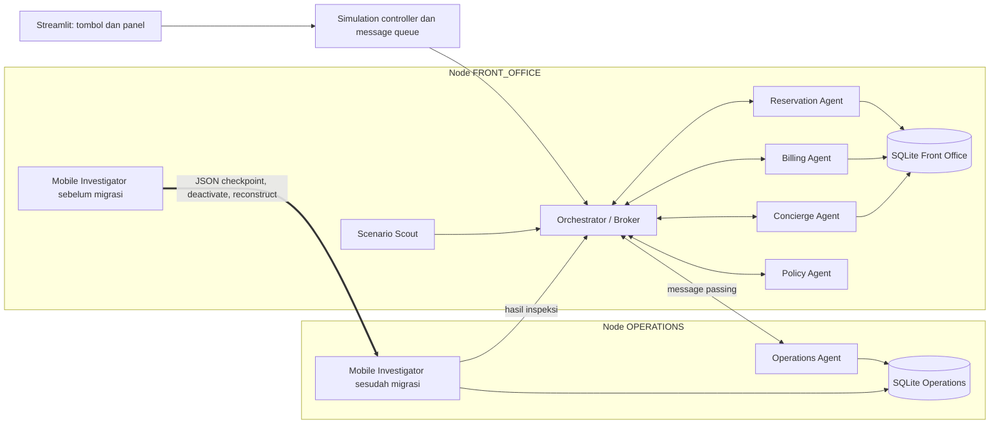

# PRD — Demo Mobile Agent Customer Service Hotel

**Versi:** 1.0  
**Bahasa produk/dokumentasi:** Indonesia  
**Stack:** Python + Streamlit, seluruh logika demo lokal  
**Pemilik tugas:** Kelompok 5  
**Status:** Siap menjadi spesifikasi implementasi MVP  
**Tanggal:** 22 September 2026

> Dokumen ini mandiri. Model pelaksana tidak perlu membaca percakapan sebelumnya untuk membangun produk. Implementasikan kebutuhan MUST dan acceptance criteria di sini. Rekomendasi riset yang lebih luas bukan tambahan scope implementasi.

## 0. Ringkasan satu halaman

Bangun aplikasi Streamlit untuk mendemonstrasikan **multi-agent customer service hotel dengan simulasi migrasi state mobile agent**. Pengguna memilih tombol skenario; tidak mengetik chat. Data reservasi, kamar, housekeeping, maintenance, tagihan, dan FAQ bersifat sintetis serta lokal.

Skenario utama: tamu mengeluhkan AC rusak dan ingin pindah kamar. Orchestrator membuat tiket, memperoleh kandidat kamar dari Reservation Agent, lalu menugaskan Mobile Investigator. Investigator berada di node Front Office, membawa tujuan dan progress melalui checkpoint JSON, berhenti di node asal, lalu direkonstruksi di node Operations dengan identitas yang sama. Di Operations, ia membaca evidence lokal housekeeping/maintenance, menentukan kamar yang layak, dan mengirim hasil. Perubahan kamar dilakukan hanya setelah persetujuan tamu dan validasi ulang.

**Bukti keberhasilan utama:** lokasi eksekusi logis berubah, ID/progress terjaga, checkpoint benar-benar diserialisasi/deserialisasi, hanya satu instance aktif, dan hasil keputusan berasal dari pemeriksaan data pada node tujuan. Diagram dan log UI harus mencerminkan eksekusi simulator.

**Arsitektur minimum:** satu proses Python, dua node logis, message queue lokal, dua database SQLite in-memory yang terpisah, agen berbasis state machine/rules, logistic regression lokal untuk prediksi kebutuhan keputusan manusia. Streamlit menyimpan satu simulator per browser session.

**Batas label:** tampilkan “Simulasi migrasi state agen antar-node logis dalam satu proses Python; kode agen tersedia di kedua node.” Tidak mengklaim perpindahan kode/call stack atau server fisik.

**Perintah akhir dari folder aplikasi:**

```bash
python -m pip install -r requirements.txt
python -m pytest -q
python -m streamlit run app.py
```

Instalasi dependensi boleh memerlukan internet. Sesudah dependensi tersedia, aplikasi dan pengujian harus berjalan tanpa akses API eksternal, unduhan model/data, atau kredensial.

---

## 1. Asal keputusan dan prioritas dokumen

### 1.1 Keputusan pengguna yang wajib dipertahankan

| ID | Keputusan |
|---|---|
| U-01 | Produk sederhana untuk demo tugas Multiagent Customer Service Hotel. |
| U-02 | Python, UI Streamlit, teks bahasa Indonesia. |
| U-03 | Input cukup tombol skenario; tidak memerlukan chat bebas. |
| U-04 | Tidak ada panggilan API untuk menjalankan demo. |
| U-05 | Konsep mobile agent wajib terlihat dan dapat dijelaskan. |
| U-06 | ML memprediksi kebutuhan pengambilan keputusan manusia. |
| U-07 | Agen boleh memindahkan tamu ke kamar setara, bersih, kosong, tanpa biaya tambahan setelah persetujuan tamu dan semua aturan terpenuhi. |
| U-08 | Refund/kompensasi, upgrade di luar aturan, sengketa tagihan, permintaan manusia, dan darurat wajib diteruskan kepada staf. |
| U-09 | Cakupan satu hotel simulasi: FAQ, maintenance/housekeeping, reservasi existing/perpindahan kamar, dan informasi/eskalasi tagihan. |
| U-10 | Deadline segera; prioritaskan end-to-end yang kecil dan demonstratif. |

### 1.2 Default implementasi yang ditetapkan PRD

Pilihan berikut ditetapkan untuk menghilangkan ambiguitas, bukan mengklaim telah dipilih satu per satu oleh pengguna: dua node logis dalam satu proses; SQLite in-memory; queue `deque`; JSON checkpoint; transfer tiga tahap; enam tombol skenario; baseline statis dengan worker lokal setara; dataset ML sintetis kecil; tidak ada thread/background job.

Jika ada konflik dengan laporan riset, gunakan PRD ini untuk scope implementasi. Jika pengguna memberi instruksi baru, catat perubahan spesifikasi sebelum mengubah perilaku yang sudah disepakati.

### 1.3 Identitas kelompok

Kelompok 5: M. Al lail Qadrillah, Dimas Prabowo, Monanta Alfiareza, Frans Alwan. NIM dan pembagian peran tidak tersedia; jangan mengarang. Identitas kelompok dapat dicantumkan di bagian “Tentang Demo”.

---

## 2. Tujuan, ruang lingkup, dan definisi selesai

### 2.1 Tujuan produk

1. Penguji dapat mengikuti satu kasus dari permintaan tamu sampai perubahan kamar atau eskalasi.
2. Penguji dapat membedakan message passing dari migrasi agen.
3. Penguji dapat memeriksa kontinuitas ID, goal, progress, dan perubahan owner node.
4. Penguji melihat pemisahan prediksi ML, policy wajib, persetujuan tamu, dan eksekusi tool.
5. Penguji dapat membandingkan jalur mobile dengan jalur statis yang mempunyai kemampuan pemrosesan lokal sama.

### 2.2 MUST di MVP

- Enam skenario pada bagian 5.
- Dua node, satu mobile investigator per kasus yang memerlukan inspeksi, dan spesialis statis.
- Step-by-step simulator, reset, persetujuan tamu, dan panel staf.
- State migration yang berfungsi, local data-access check, dan penolakan checkpoint tidak valid.
- Logistic regression benar-benar di-fit dari dataset lokal, dengan metrik test sintetis ditampilkan.
- Database lokal untuk transaksi simulasi dan log/audit.
- Perbandingan static/mobile untuk S01 dan S02.
- Automated tests untuk invariant migrasi, policy, transaksi, dan rerun UI.
- README berisi cara menjalankan, keterbatasan, dan alur presentasi.

### 2.3 Di luar scope versi ini

- Chat bebas, LLM, NLP/DL, RL, GNN, vector database, RAG, API vendor/HTTP backend.
- WhatsApp, booking baru, perubahan tanggal, pembayaran nyata, login produksi.
- Docker, microservices, multiprocess migration, migrasi kode atau stack Python.
- Refund/upgrade otomatis, simulasi keamanan host bermusuhan, blockchain.
- Klaim akurasi industri, peningkatan performa jaringan nyata, atau penghematan biaya operasional hotel.

**Catatan akademik:** DL/RL/GNN ada di layout tugas, tetapi kewajiban implementasinya belum dikonfirmasi. MVP ini sengaja memilih ML + rules sesuai keputusan terakhir. README harus menandai DL/RL/GNN “tidak diimplementasikan pada MVP”; jangan mengklaim telah memenuhi semua metode rubrik.

### 2.4 Definisi selesai

Semua MUST dan tes bagian 17 lulus; enam skenario berjalan tanpa API; S01 dapat mengubah kamar setelah consent; S02/S03 mengeskalasi; trace menunjukkan migrasi sungguhan dalam simulator; baseline setara tersedia; README dan hasil test aktual dilaporkan. Screenshot saja tidak cukup.

---

## 3. Istilah dan batas semantik

| Istilah | Definisi implementasi |
|---|---|
| Node | Runtime logis yang memiliki registry agen dan database lokal. |
| Static agent | Agen tidak berpindah node; dapat mengirim pesan ke node lain. |
| Mobile Investigator | Agen beridentitas tetap yang instance aktifnya dipindahkan antar-runtime melalui JSON state. |
| Migration | Serialisasi state → sumber inactive → rekonstruksi instance di tujuan → resume fase. |
| Message passing | Pengiriman request/response; sender tetap di lokasi asal. |
| Goal | Hasil yang ingin dicapai agen, misalnya menemukan kamar pengganti layak. |
| Phase | Progress eksplisit state machine; bukan call stack. |
| Human judgment | Keputusan/penanganan diambil alih staf karena policy atau prediksi kebutuhan review. |
| Fulfillment | Pekerjaan fisik staf, misalnya memperbaiki AC; tidak otomatis human judgment. |
| Consent | Persetujuan tamu atas tawaran konkret, bukan persetujuan staf. |
| Terminal case | Alur digital demo selesai; tiket fisik bisa masih terbuka. |

Prinsip implementasi agen: **observe → decide → act → observe/update state**. Rules adalah mekanisme keputusan yang sah untuk demo. Jangan menambah LLM agar agen terlihat “cerdas”.

---

## 4. Aktor dan UI peran

| Aktor | Aktivitas |
|---|---|
| Presenter/mahasiswa | Memilih skenario, menjalankan langkah, menjelaskan checkpoint dan hasil. |
| Tamu simulasi | Klik setuju/tolak tawaran kamar; input awal berasal dari tombol skenario. |
| Staf simulasi | Mengambil alih kasus, memperbarui tiket, menutup kasus dengan catatan. |
| Dosen/pengamat | Memeriksa node, message log, policy, database, dan evaluasi. |

Panel tamu dan staf adalah role-play dalam satu halaman. Beri label “Simulasi Peran”; ini bukan sistem autentikasi pengguna.

---

## 5. Data seed dan skenario deterministik

### 5.1 Seed bersama

Hotel fiktif: **Hotel Nusantara Demo**. Semua nilai adalah data demonstrasi.

**Front Office DB:**

| Entitas | Nilai |
|---|---|
| Guest | `G001`, nama “Tamu Demo” |
| Reservation | `RES001`, guest `G001`, room `R101`, tipe `standard`, rate `500000`, status `checked_in`, version `1` |
| R101 | `standard`, rate `500000`, occupied oleh `RES001`, version `1` |
| R102 | `standard`, rate `500000`, vacant, version `1` |
| R103 | `standard`, rate `500000`, vacant, version `1` |
| R201 | `deluxe`, rate `750000`, vacant, version `1` |
| Folio F01 | `RES001`, “Kamar 1 malam”, `500000` rupiah |
| Folio F02 | `RES001`, “Minibar”, `150000` rupiah |
| FAQ check-in | “Waktu check-in Hotel Nusantara Demo mulai pukul 14.00.” |

**Operations DB:**

| Room | cleanliness | maintenance_blocked | evidence_version |
|---|---|---:|---:|
| R101 | clean | true | 1 |
| R102 | dirty | false | 1 |
| R103 | clean | false | 1 |
| R201 | clean | false | 1 |

R102 sengaja kosong tetapi kotor agar keputusan investigator terlihat berguna. Kondisi kosong dari PMS saja tidak berarti siap ditempati. R101 sudah memiliki block pada seed sebagai kondisi simulasi AC bermasalah; tiket kasus baru tetap dibuat secara idempotent.

Uang disimpan sebagai integer rupiah, bukan floating point. ID deterministik per run: `CASE-001`, `TICKET-001`, `MA-001`, `MIG-001`. `run_id` unik memisahkan run; reset membuat run baru tanpa membawa data transaksi sebelumnya.

### 5.2 Tombol skenario wajib

Fitur ML berurutan `(intent_complexity, risk_level, prior_failed_attempts, context_missing)`; detail bagian 11.

| ID/tombol | Input tamu tetap | Perubahan seed | Fitur ML | Hasil utama |
|---|---|---|---|---|
| S01 — AC rusak: kamar pengganti tersedia | “AC kamar saya rusak. Saya ingin pindah ke kamar setara.” | Tidak ada | `(2,0,0,0)` | Ticket dibuat; kandidat R102/R103; investigator menolak R102 dan merekomendasikan R103; tunggu consent; commit setelah validasi ulang. |
| S02 — AC rusak: kamar setara habis | “AC rusak. Kalau kamar setara habis, saya ingin upgrade gratis.” | R102 dan R103 occupied oleh reservasi dummy berbeda; buat reservasi dummy konsisten dengan kamar. R201 tetap kosong/siap. | `(3,1,0,0)` | Mandatory upgrade escalation; evidence gathering boleh berjalan. Investigator memeriksa R201, mencatat siap tetapi upgrade; staf memutuskan, tidak ada auto room change. |
| S03 — Sengketa tagihan | “Saya tidak mengenali tagihan minibar Rp150.000. Tolong hapus.” | Tidak ada | `(4,1,0,0)` | Billing mengambil F02; policy wajib eskalasi; tidak membuat mobile investigator; folio tidak berubah. |
| S04 — Informasi check-in | “Jam check-in hotel berapa?” | Tidak ada | `(1,0,0,0)` | Jawaban dari FAQ lokal; selesai tanpa migrasi/tiket. |
| S05 — Minta handuk | “Tolong antar handuk ke kamar saya.” | Tidak ada | `(1,0,0,0)` | Ticket housekeeping dibuat, status pending; staf dapat memperbarui sampai selesai; bukan human judgment. |
| S06 — Rincian tagihan | “Tampilkan rincian tagihan saya.” | Tidak ada | `(1,0,0,0)` | Billing menampilkan F01/F02 dan total Rp650.000; selesai tanpa migrasi. |

Pada S02, policy wajib sudah terdeteksi saat triase. `human_required=true` disimpan sejak itu; proses inspeksi hanya mengumpulkan evidence untuk staf. Tampilan tidak boleh memberi kesan agen masih berhak melakukan upgrade otomatis. Setelah evidence lengkap, alur berhenti pada `WAITING_HUMAN`.

### 5.3 Pilihan pengguna dalam S01

- **Setuju pindah ke R103:** kirim event consent yang mengikat `case_id`, `proposed_room_id`, dan versi proposal; validasi ulang lalu commit.
- **Tolak perpindahan:** reservasi tetap R101; case `CLOSED_GUEST_DECLINED`; tiket tetap terbuka; teks “Perpindahan dibatalkan atas pilihan tamu; tiket perbaikan tetap aktif.”
- Tidak memilih: tetap `WAITING_GUEST`, tidak ada transaksi.

### 5.4 Kasus konflik untuk pengujian

Setelah proposal R103 tetapi sebelum consent, tes mengubah R103 menjadi occupied atau evidence readiness-nya berubah. Commit wajib ditolak, reservasi tetap R101, status `WAITING_HUMAN` dengan alasan `STALE_ROOM_STATE`. Tidak perlu tombol khusus konflik di UI MVP; fixture pengujian harus tersedia.

---

## 6. Arsitektur, agen, dan tanggung jawab



M1/M2 adalah satu identitas pada dua waktu. Dalam baseline statis, M1 tetap di Front Office dan mengirim satu batch inspeksi ke Operations Agent; tidak ada M2.

| Agen | Lokasi | Goal/observasi | Keputusan dan aksi | Role rubrik |
|---|---|---|---|---|
| Scenario Scout | FRONT_OFFICE, statis | Mengenali skenario terpilih | Membentuk request terstruktur dari fixture; tanpa NLP | Scout |
| Orchestrator | FRONT_OFFICE, statis | Menyelesaikan goal kasus dari respons spesialis | Mengalokasikan subtask, menunggu evidence/consent, menentukan next step sesuai policy | Broker |
| Reservation Agent | FRONT_OFFICE, statis | Reservasi, occupancy, tipe, tarif | Menyusun kandidat; mengusulkan; menjalankan room change melalui tool guarded | Worker |
| Concierge Agent | FRONT_OFFICE, statis | FAQ lokal | Mengambil jawaban untuk FAQ key | Worker |
| Billing Agent | FRONT_OFFICE, statis | Folio reservasi | Merinci tagihan/mengumpulkan entry sengketa; tidak menulis nilai finansial | Worker |
| Policy Agent | FRONT_OFFICE, statis | Flags kasus, hasil ML, constraint aksi | Mengeluarkan keputusan allow/review/deny dan reason codes | Security/rules |
| Operations Agent | OPERATIONS, statis | Readiness, tiket | Membuat/update tiket; memberi readiness evidence; menjalankan batch kernel pada baseline | Worker |
| Mobile Investigator | Awalnya FRONT_OFFICE, mobile | Goal, kandidat, progress, hasil lokal | Memilih node yang mempunyai capability inspeksi; migrasi bila diperlukan; menyaring kandidat dan melaporkan hasil | Mobile Scout/Worker |

Semua agen dapat berupa class Python kecil dengan `handle(message, context)`. Tidak memerlukan framework multi-agent. State lokal masing-masing minimal menyimpan `agent_id`, `node_id`, `status`, `case_id`, `last_action`. Investigator memiliki state lebih lengkap pada bagian 8.

Capability ditentukan konfigurasi runtime berdasarkan jenis agen terdaftar, bukan dipercayai dari checkpoint/payload: Mobile Investigator dan Operations Agent memiliki `inspect_readiness`; Operations Agent memiliki `create_ticket`/`update_ticket`; Reservation Agent memiliki `read_reservation`/`commit_room_change`; Billing hanya `read_folio`. Node mendefinisikan kemampuan data yang tersedia: Front Office untuk reservasi/folio/FAQ, Operations untuk readiness/tiket.

Policy Agent tidak satu-satunya enforcement: tool room change dan runtime local-read tetap memvalidasi constraint agar direct call tidak melewati aturan.

---

## 7. Engine, state kasus, dan message passing

### 7.1 Struktur simulator

`Simulation` memiliki `run_id`, `mode` (`mobile`/`static`), `nodes`, `agents`, `queue`, `case`, `migration`, `events`, `metrics`, model ML read-only, dan repository per node.

- Satu kasus aktif per simulator; tidak ada concurrency/thread.
- UI rerun tidak mengeksekusi step secara otomatis.
- Pemilihan skenario membuat simulator baru dengan deep/reset seed; model terlatih boleh digunakan ulang karena immutable.
- `step()` memproses tepat satu queue item, atau satu tahap migrasi yang sedang berlangsung. Hasil handler boleh menambah beberapa pesan berikutnya, tetapi tidak menjalankan seluruh queue secara rekursif.
- Prioritas `step()`: jika transfer sedang berjalan, lanjutkan satu tahap; jika tidak, pop satu pesan FIFO; jika keduanya kosong, no-op dengan status menunggu/selesai yang sesuai.
- Jika menunggu input tamu/staf dan queue kosong, tombol step disabled.
- `run_until_pause(max_steps=100)` hanya untuk pengujian/evaluasi; berhenti pada input manusia/terminal; jika batas terlewati, laporkan error loop, bukan success.

Method `has_pending_work()` menjadi satu sumber enabling tombol. Method `is_paused()` memeriksa **status kasus dan queue/transit**, bukan hanya flag `human_required`: S02 harus menyelesaikan pengumpulan evidence meskipun sudah ditandai wajib staf.

### 7.2 Status kasus

| Status | Arti / transisi keluar |
|---|---|
| `CREATED` | Request dibuat; next triase |
| `PROCESSING` | Subtask/pesan/inspeksi berjalan |
| `WAITING_GUEST` | Proposal kamar final tersedia; setuju/tolak |
| `WAITING_HUMAN` | Keputusan staf diperlukan; ambil alih |
| `HUMAN_HANDLING` | Staf sudah mengambil alih; bisa menutup dengan catatan |
| `DIGITAL_COMPLETED` | Jawaban, dispatch, atau perubahan kamar berhasil secara digital |
| `CLOSED_GUEST_DECLINED` | Tamu menolak perpindahan |
| `CLOSED_BY_STAFF` | Kasus ditutup manual dengan catatan |
| `FAILED` | Kegagalan teknis yang tidak dipulihkan |

Terminal digital tidak berarti AC sudah diperbaiki. Status tiket disimpan terpisah: `PENDING`, `IN_PROGRESS`, `DONE`. Panel staf tetap dapat mengupdate tiket setelah `DIGITAL_COMPLETED`.

Flags `human_required`, `human_reason_codes`, dan `priority` tidak diganti oleh status proses. Kasus S02 bisa `PROCESSING` sambil sudah `human_required=true`.

### 7.3 Kontrak pesan

```json
{
  "message_id": "MSG-001",
  "run_id": "run-...",
  "case_id": "CASE-001",
  "sender": "orchestrator",
  "receiver": "reservation",
  "source_node": "FRONT_OFFICE",
  "destination_node": "FRONT_OFFICE",
  "kind": "REQUEST",
  "action": "FIND_ROOM_CANDIDATES",
  "correlation_id": "TASK-ROOM-001",
  "payload": {"reservation_id": "RES001"}
}
```

`kind` enum: `REQUEST`, `INFORM`, `FAILURE`. `action` enum minimal: `START_CASE`, `TRIAGE_RESULT`, `CREATE_TICKET`, `TICKET_CREATED`, `FIND_ROOM_CANDIDATES`, `CANDIDATES_FOUND`, `INSPECT_CANDIDATES`, `INSPECTION_RESULT`, `GET_READINESS`, `READINESS_RESULT`, `GET_FOLIO`, `FOLIO_RESULT`, `GET_FAQ`, `FAQ_RESULT`, `GUEST_CONSENT`, `COMMIT_ROOM_CHANGE`, `ROOM_CHANGE_RESULT`, `STAFF_ACTION`.

`START_CASE` mengandung fixture ID/intent/features/flags dari Scout. Recipient boleh memanggil policy/model lokal untuk triase dan mencatat hasil; policy call in-node tidak harus memiliki round trip tersendiri. Intent adalah enum dari skenario, bukan hasil tebakan NLP.

Setiap enqueue menghasilkan event `MESSAGE_SENT`; setiap dequeue menghasilkan `MESSAGE_DELIVERED`. Hitung jumlah komunikasi berdasarkan `MESSAGE_SENT` saja agar tidak double count. Hasil tool lokal bukan otomatis pesan antar-node.

**Idempotency:** simpan `processed_message_ids`; ID yang telah diproses diabaikan dengan event `DUPLICATE_IGNORED`. Operation key per side effect tetap wajib karena dua pesan berbeda bisa meminta operasi sama.

### 7.4 Urutan bisnis S01/S02

1. Scout mengirim `START_CASE`.
2. Orchestrator menghitung ML + policy, membuat case, meminta ticket Operations.
3. Setelah `TICKET_CREATED`, Orchestrator meminta kandidat Reservation.
4. Reservation membaca FO DB dan mengirim candidate snapshots; S01 kandidat standard kosong, S02 alternatif deluxe kosong untuk review.
5. Orchestrator menciptakan investigator MA-001 pada Front Office dengan kandidat dan goal; meminta inspeksi.
6. Mode mobile: investigator melihat capability inspeksi ada di Operations, menyiapkan phase `INSPECT_LOCAL`, lalu memulai migrasi tiga tahap. Mode static mengikuti bagian 14.
7. Investigator di Operations memeriksa seluruh kandidat dengan kernel yang sama seperti baseline, menyimpan rejection reasons dan hasil, lalu mengirim `INSPECTION_RESULT`.
8. S01: Reservation/Orchestrator memilih kandidat feasible pertama berurutan room ID; menampilkan proposal/consent. S02: hasil dan estimasi selisih tarif menjadi evidence staf; `WAITING_HUMAN`.
9. S01 consent disetujui: Reservation meminta readiness terbaru via pesan Operations; ketika respons diterima, lakukan recheck FO version/occupancy/rate dan commit atomik FO DB. Jangan mutate DB selama render UI.
10. S01 sukses: `DIGITAL_COMPLETED`; investigator tetap di Operations berstatus `DONE`. Tidak perlu migrasi pulang; pengiriman hasil adalah message passing.

Tiket dibuat sebelum investigasi dan tetap ada jika tamu menolak atau kasus dieskalasi.

Untuk kasus selain S02 yang langsung memerlukan judgment karena policy/ML, kumpulkan informasi read-only yang relevan lalu berhenti WAITING_HUMAN; tidak melanjutkan aksi perubahan kamar. S03 mengambil folio sebelum menunggu staf. S04/S05/S06 dalam recipe low-risk mengikuti jalur rutin tabel skenario. Untuk seluruh handler, action/recipient yang tidak dikenal menghasilkan structured failure dan event, bukan exception UI atau pesan yang hilang diam-diam.

---

## 8. Spesifikasi mobile agent dan migrasi — fitur terpenting

### 8.1 State checkpoint

```json
{
  "schema_version": 1,
  "code_version": "investigator-v1",
  "agent_id": "MA-001",
  "case_id": "CASE-001",
  "goal": "FIND_READY_REPLACEMENT_ROOM",
  "phase": "INSPECT_LOCAL",
  "current_node": "FRONT_OFFICE",
  "reservation_id": "RES001",
  "original_room_id": "R101",
  "constraints": {"room_type": "standard", "max_rate": 500000},
  "candidate_rooms": [
    {"room_id": "R102", "room_type": "standard", "rate": 500000, "room_version": 1},
    {"room_id": "R103", "room_type": "standard", "rate": 500000, "room_version": 1}
  ],
  "visited_nodes": ["FRONT_OFFICE"],
  "inspection_results": [],
  "migration_count": 0
}
```

Checkpoint tidak memuat objek Python, SQLite connection, UI state, model ML, method/function, atau credential. Kode `MobileInvestigator.from_checkpoint()` sudah tersedia pada runtime tujuan.

Phase investigator: `CREATED` → `READY_TO_MOVE` → `INSPECT_LOCAL` → `REPORT_RESULT` → `DONE`; kegagalan bisa `FAILED`. Status runtime terpisah: `ACTIVE`, `SUSPENDED`, `IN_TRANSIT`, `DONE`, `FAILED`.

Sebelum serialisasi, tetapkan phase kelanjutan `INSPECT_LOCAL`. Jangan set progress yang diperlukan hanya setelah checkpoint dibuat.

### 8.2 Registry ownership

Setiap node memiliki `active_agents: dict[agent_id, agent_instance]`. Simulator menyimpan `owner_by_agent: dict[agent_id, node_id | None]` dan registry arsip/checkpoint terpisah.

Invariant yang wajib diuji:

```text
jumlah instance aktif untuk agent_id yang sama ∈ {0,1}
owner_by_agent != None  => tepat satu instance aktif di node tersebut
selama IN_TRANSIT      => 0 instance aktif, owner None, checkpoint tersedia
setelah sukses         => instance tujuan baru; bukan objek sumber yang dipindah pointer
```

Agent yang `DONE` boleh diarsipkan dan dihapus dari active registry; location terakhir tetap tampil. Jangan menghitung archived record sebagai instance aktif.

### 8.3 Tiga tahap migrasi yang terlihat di UI

**Tahap M1 — PREPARE**

1. Validasi source owns agent, destination `OPERATIONS` aktif, schema/code version didukung, dan agent memiliki capability `inspect_readiness`.
2. Buat checkpoint menggunakan `json.dumps(..., sort_keys=True, separators=(",", ":"), ensure_ascii=False).encode("utf-8")`.
3. Simpan `sha256`, ukuran byte, source/destination, migration ID dan snapshot before. Lakukan parse validation terhadap bytes, bukan terhadap objek sebelum serialisasi saja.
4. Source tetap owner tetapi `SUSPENDED`; tidak boleh menjalankan behavior selama transfer. Event `MIGRATION_PREPARED`.

**Tahap M2 — DEPART**

1. Simpan checkpoint dalam `migration.in_transit_bytes`.
2. Hapus instance source dari active registry; simpan metadata terakhir untuk UI.
3. Set owner `None`, migration `IN_TRANSIT`; event `MIGRATION_DEPARTED`.
4. UI menunjukkan agent di jalur transfer, tidak berada aktif pada dua node.

**Tahap M3 — ARRIVE**

1. Verifikasi ulang destination tersedia, hash, schema/code version, ID dan required fields.
2. `json.loads()` bytes; bangun objek baru melalui `from_checkpoint()`.
3. Pertahankan ID/goal/case/candidates/progress, ganti `current_node` ke Operations, append `visited_nodes`, tambah `migration_count` satu kali.
4. Daftarkan instance baru di destination; set owner; status `ACTIVE`; event `MIGRATION_ARRIVED`.
5. Simpan snapshot after dan enqueue `INSPECT_CANDIDATES` ke instance tujuan. Pemeriksaan data lokal dilakukan pada step berikutnya agar resume terlihat.

**Penolakan/kegagalan:** sebelum DEPART, source tetap satu-satunya owner dan dikembalikan ACTIVE. Sesudah DEPART, jika ARRIVE gagal, restore source dari salinan checkpoint asli yang disimpan terpisah; tidak memakai bytes yang rusak. Buat satu event `MIGRATION_FAILED`, jangan auto-retry loop; investigator `FAILED`, case `WAITING_HUMAN`, alasan teknis eksplisit. Jika restore tidak mungkin, case `FAILED` dan jangan mengaktifkan agen spekulatif.

SHA-256 dipakai untuk deteksi korupsi demo, **bukan autentikasi/signature**. Allowlist node/capability dan validasi schema adalah simulasi kontrol akses, bukan sandbox OS.

`MigrationRecord` wajib menyimpan `migration_id`, `agent_id`, `case_id`, source/destination, stage, expected hash, original bytes untuk restore, in-transit bytes, before/after snapshots, dan error. Pada ARRIVE, cocokkan agent/case/current_node checkpoint dengan record sumber tepercaya; target diambil dari MigrationRecord, bukan field payload yang bisa diubah. Hash bukan satu-satunya validasi. Setelah record SUCCEEDED/FAILED, `step()` tidak boleh memproses tahap itu lagi. Pemanggilan ulang ARRIVE untuk migration ID sukses menjadi no-op terlog tanpa instance baru/migration_count tambahan.

### 8.4 Local reasoning setelah tiba

Kernel `evaluate_candidates(candidate_snapshots, readiness_records, constraints)` menghasilkan untuk setiap kamar:

- `is_ready = cleanliness == "clean" and not maintenance_blocked`.
- `is_routine_eligible = is_ready and room_type == requested_type and rate <= max_rate`.
- `reason_codes`: misalnya `DIRTY`, `MAINTENANCE_BLOCKED`, `UPGRADE_REQUIRES_HUMAN`, `READY_EQUAL_ROOM`.
- `room_version`, `evidence_version`, dan rate delta dari snapshot.

Kamar ready tetapi lebih mahal boleh dilaporkan sebagai alternatif staf; tidak boleh dianggap rutin. Kernel tidak mengubah DB. Occupancy final diverifikasi lagi saat commit karena snapshot bisa usang.

Runtime Operations memberi akses `read_local_readiness()` hanya kepada agent yang current owner-nya Operations dan mempunyai capability. Investigator di Front Office tidak boleh memanggil method itu langsung dengan mengganti `node_id` di payload; runtime harus memeriksa registry.

---

## 9. Kontrak database dan tools lokal

### 9.1 Penyimpanan

- Gunakan `sqlite3` standard library, satu connection `:memory:` per node per simulator.
- Data seed dibaca dari file JSON lokal lalu dimasukkan ke tabel.
- Connection dibuat dengan `check_same_thread=False` hanya untuk kompatibilitas rerun Streamlit; engine tetap single-thread/sequential. Tidak ada worker background atau akses concurrent.
- Jangan letakkan simulator/connection mutable dalam cache global Streamlit. Reset menutup dua connection lama lalu membuat simulator baru.
- SQLite persistence lintas restart tidak diperlukan; ekspor log JSON/CSV memberi artefak laporan.

### 9.2 Tabel minimal

| Node | Tabel dan kolom inti |
|---|---|
| FO | `guests(id PRIMARY KEY, name)` |
| FO | `reservations(id PRIMARY KEY, guest_id, room_id, room_type, nightly_rate INTEGER, status, version INTEGER)` |
| FO | `rooms(id PRIMARY KEY, room_type, nightly_rate INTEGER, occupied_by NULLABLE, version INTEGER)` |
| FO | `folio_entries(id PRIMARY KEY, reservation_id, description, amount INTEGER)` |
| FO | `faq(key PRIMARY KEY, answer)` |
| FO | `cases(id PRIMARY KEY, scenario_id, status, human_required INTEGER, reason_codes_json, proposed_room_id NULLABLE, proposal_version INTEGER, consent_json NULLABLE)` |
| FO | `audit_events(seq PRIMARY KEY, event_type, payload_json)` |
| FO | `applied_operations(operation_key PRIMARY KEY, result_json)` |
| OPS | `room_readiness(room_id PRIMARY KEY, cleanliness, maintenance_blocked INTEGER, evidence_version INTEGER)` |
| OPS | `tickets(id PRIMARY KEY, operation_key UNIQUE, case_id, room_id, department, description, status)` |
| OPS | `applied_operations(operation_key PRIMARY KEY, result_json)` |

Foreign key enforcement aktif untuk relasi dalam node. Tidak ada foreign key lintas connection; business checks menjaga ID references. Case object dalam simulator menjadi working state; setiap perubahan status wajib disinkronkan ke tabel `cases` melalui satu method repository, bukan dua jalur update terpisah.

### 9.3 Tools dan hasil

| Tool | Input | Output / efek |
|---|---|---|
| `get_reservation` | reservation_id | Snapshot reservasi atau structured error |
| `find_candidates` | reservation_id, include_upgrade_alternatives | Daftar kamar kosong terurut; S02 mengizinkan alternatif untuk evidence saja |
| `get_folio` | reservation_id | Entries dan total rupiah |
| `get_faq` | key | Jawaban lokal atau unknown |
| `create_ticket` | case_id, room_id, department, description, operation_key | Ticket ID; key sama mengembalikan hasil sama |
| `get_readiness` | room_ids, caller context | Readiness snapshots; dibatasi runtime OPS |
| `commit_room_change` | reservation_id, target_room_id, expected_versions, fresh_readiness, consent, operation_key, policy decision | Perubahan atomik FO atau refusal terstruktur |
| `update_ticket_status` | ticket_id, next_status, actor | Transisi PENDING→IN_PROGRESS→DONE; actor staf simulasi |

Format error minimal `{code, message, details}`; gunakan code stabil pada tes. Teks message bahasa Indonesia.

### 9.4 Commit room change

Dalam satu transaksi FO:

1. Jika operation key sudah diterapkan, kembalikan hasil tersimpan tanpa side effect baru.
2. Validasi case bukan wajib human review, consent cocok proposal/room, reservasi checked-in dan version cocok.
3. Target berbeda dari asal, vacant, tipe setara, tarif tidak lebih tinggi, version cocok.
4. Validasi fresh readiness bersih/tidak diblokir dan version masih sama dengan proposal. Respons readiness harus berasal dari Operations Agent dan correlation ID recheck yang benar; bukan payload browser arbitrer.
5. Ubah occupancy kamar asal menjadi kosong, target menjadi RES001, reservasi menjadi target; naikkan version seluruh record yang berubah.
6. Simpan operation result lalu commit. Exception/refusal rollback semua perubahan FO.

Recheck dan commit dijalankan sebagai satu handler setelah pesan readiness diterima; simulator single-thread tidak memproses command lain di antaranya. Ini asumsi simulasi, bukan transaksi atomik lintas server produksi.

Kamar asal tetap maintenance blocked pada OPS sampai staf memperbaikinya; pindah kamar tidak membuat AC otomatis sehat. Saat tiket maintenance `DONE`, Operations boleh mengubah block kamar tiket menjadi false dan menaikkan evidence_version; jelaskan itu hasil input staf simulasi.

---

## 10. Policy dan pengambilalihan manusia

### 10.1 Prioritas keputusan

```text
mandatory flags (emergency/request_human/financial_dispute/
                 compensation_requested/upgrade_exception)
    => human_required = true, source = POLICY
else P(human_judgment | features) >= 0.80
    => human_required = true, source = ML
else
    => tindakan dalam batas kewenangan, source = POLICY_AND_ML
```

Flags berasal dari fixture dan fakta yang ditemukan, bukan keywords chat. Saat konteks berubah (misalnya hanya upgrade tersedia), policy dievaluasi ulang. Riwayat keputusan lama tetap tercatat. Once `human_required` ditetapkan pada satu run, agen tidak menurunkannya sendiri; staf mengambil alih.

Tampilkan `p_human`, threshold, `model_recommends_human`, `mandatory_reasons`, `final_decision`, dan `decision_source` secara terpisah.

### 10.2 Hasil eskalasi

- Kasus `WAITING_HUMAN` menampilkan ringkasan bukti dan tombol **“Staf: Ambil Alih”**.
- Setelah diambil alih, `HUMAN_HANDLING`; sediakan textarea catatan staf dan tombol **“Staf: Tutup Kasus”**, wajib catatan nonkosong.
- Menutup kasus hanya mencatat keputusan/penanganan manual; tidak diam-diam mengubah kamar/tagihan. S02/S03 berakhir dengan data finansial/reservasi unchanged.
- “Tutup kasus” tidak mengubah tiket menjadi DONE; update tiket terpisah.
- Emergency mendapat `priority=URGENT`, lainnya `NORMAL`. Tidak perlu skenario emergency khusus, tetapi uji policy-nya wajib.

---

## 11. ML lokal: spesifikasi minimum yang dapat direproduksi

### 11.1 Tujuan dan pembatasan

Target `needs_human_judgment`: apakah kasus perlu keputusan manusia. Bukan apakah staf harus melakukan pekerjaan fisik, bukan probabilitas jawaban benar. Tidak memerlukan NLP karena fitur sudah disediakan skenario.

Gunakan scikit-learn dengan konstruksi yang valid berikut:

```python
Pipeline([
    ("scaler", StandardScaler()),
    ("classifier", LogisticRegression(C=1.0, max_iter=1000, random_state=42)),
])
```

Panggil `fit` pada training split; jangan mengganti model dengan bobot contoh tugas 1 atau angka probabilitas hardcoded. Urutan kolom input selalu mengikuti tabel fitur; cari kolom kelas positif `1` dari `classes_` ketika mengambil `predict_proba`.

### 11.2 Dataset sintetis ditentukan secara eksplisit

Buat file `data/escalation_synthetic.csv` dari cartesian product 48 kombinasi unik:

| Fitur | Nilai |
|---|---|
| intent_complexity | 1, 2, 3, 4 |
| risk_level | 0, 1 |
| prior_failed_attempts | 0, 1, 2 |
| context_missing | 0, 1 |

Urutkan nested loop sesuai urutan fitur tabel. `row_id = E001...E048`. Label ilustratif:

```text
score = intent_complexity + 2*risk_level
        + prior_failed_attempts + 2*context_missing
needs_human_judgment = int(score >= 6)
```

Ini **aturan anotasi sintetis untuk demo belajar**, bukan SOP hotel yang tervalidasi. Model mempelajari aproksimasi aturan tersebut; tidak ada klaim bahwa ML lebih baik daripada rules. Mandatory flags tidak menjadi target/fitur tersembunyi; enforcement tetap pada policy.

`train_test_split(test_size=0.25, random_state=42, stratify=y)` menghasilkan 36 train dan 12 test. Fit scaler/model hanya pada train. Tidak menggandakan rows/noise/paraphrase agar terlihat besar. Simpan manifest row IDs dan hash dataset dalam report.

Split dilakukan bersamaan atas `X`, `y`, dan row IDs agar manifest konsisten. Recipe ini adalah spesifikasi yang harus dijalankan dan diverifikasi saat implementasi, bukan hasil training yang sudah diukur pada tahap penulisan PRD.

Threshold `0.80` adalah parameter demonstrasi yang mengikuti contoh tugas 1, **bukan hasil optimisasi**. Jangan tuning setelah melihat test set. Pada test split tampilkan confusion matrix, precision, recall, F1, accuracy menggunakan threshold 0.80 dan `zero_division=0`, beserta jumlah sampel. Tidak ada target angka accuracy wajib.

### 11.3 Lifecycle offline

- Dataset CSV disertakan dalam repo; sediakan fungsi/script pembangkit untuk reproduksi dan test bahwa hasilnya identik.
- Saat aplikasi pertama dibuka, fit model kecil lokal dari CSV melalui `st.cache_resource` untuk model read-only, atau fungsi cache immutable setara. Rerun tidak melatih ulang.
- Tidak perlu pickle/joblib model dari internet; tidak perlu API/Hugging Face.
- Perintah `python -m hotel_demo.ml` mencetak report dan bisa menulis report JSON ke output yang dipilih sesuai README. UI menampilkan report yang dihitung, bukan hasil palsu di seed.
- UI harus menampilkan “Dataset sintetis 48 kombinasi; metrik hanya ilustrasi pada 12 contoh uji. Bukan validasi operasional hotel.”

### 11.4 Interaksi ML dengan skenario

Gunakan fitur tabel skenario, hitung probabilitas aktual. Jangan hardcode `p=0.961`. Skenario low-risk S01/S04/S05/S06 seharusnya berada di bawah threshold; tes verifikasi dengan training recipe ini. Bila tidak, laporkan mismatch secara eksplisit dan perbaiki rancangan data/parameter secara terdokumentasi, bukan override score supaya demo lolos.

Uji jalur policy dengan model stub `p=0.01` dan `p=0.99` untuk membuktikan aturan wajib dan ML-only review tanpa bergantung pada distribusi model kecil. Stub hanya dalam tes, bukan aplikasi.

---

## 12. UI Streamlit yang wajib dibangun

### 12.1 Layout

`st.set_page_config(page_title="Demo Mobile Agent Hotel", layout="wide")`.

**Header:** nama aplikasi, deskripsi satu kalimat, badge “Lokal · Data Simulasi · Tanpa API”, keterangan dua node logis. Mode aktif terlihat jelas.

**Sidebar:**

1. Pilihan mode radio: “Mobile Agent” default / “Static Agent”. Berlaku pada run baru.
2. Enam tombol skenario dengan label tabel bagian 5; klik memulai run baru dari seed sesuai pilihan mode.
3. “Reset Skenario” mengulang skenario aktif dari seed; disabled jika belum memilih.
4. Ringkasan aturan otonomi dan tombol/expander “Tentang Demo”.

Jika mode diubah saat kasus berjalan, jangan mengubah mesin yang aktif. Tampilkan “Mode baru berlaku saat memilih/reset skenario”; simpan `active_mode` dalam simulator.

**Area utama, tab:**

- **Simulasi**: pesan tamu tetap, status kasus, keputusan ML/policy, dua kolom node, area transit, kontrol “Langkah Berikutnya”, respons agen, consent dan panel staf.
- **Jejak & State**: tabel pesan/event, JSON checkpoint sebelum/sesudah, daftar penolakan kandidat, database snapshots, unduh log JSON.
- **Evaluasi**: hasil perbandingan S01/S02 static–mobile dan report ML sintetis.

Hindari library diagram eksternal/CDN. Dua `st.container`/`st.columns` dan label panah cukup. Diagram boleh berupa teks tetap, tetapi isi node/agen/status harus berasal dari registry simulator.

### 12.2 Kartu agen dan transit

Tampilkan minimal `agent_id`, tipe static/mobile, node, runtime status, phase, last_action. Node Front Office dan Operations harus selalu terlihat, termasuk saat kosong.

Pada M1: source SUSPENDED, checkpoint ready. Pada M2: tidak ada instance aktif di dua node, kartu di area “Dalam Transit”. Pada M3: kartu ada di Operations dengan ID sama dan phase `INSPECT_LOCAL`. Investigator DONE tetap terlihat sebagai arsip, dengan label nonaktif.

### 12.3 Tombol aksi dan aturan enabling

| Tombol | Aktif jika | Efek |
|---|---|---|
| Langkah Berikutnya | Queue/transit mempunyai pekerjaan | Satu engine step lalu render |
| Tamu: Setuju pindah ke {room} | WAITING_GUEST, proposal ada | Enqueue consent sekali, status PROCESSING |
| Tamu: Tolak perpindahan | WAITING_GUEST | Catat penolakan, tutup digital tanpa room change |
| Staf: Ambil Alih | WAITING_HUMAN | HUMAN_HANDLING |
| Staf: Tutup Kasus | HUMAN_HANDLING + catatan | CLOSED_BY_STAFF |
| Staf: Mulai Pekerjaan | Ticket PENDING | Ticket IN_PROGRESS |
| Staf: Selesaikan Pekerjaan | Ticket IN_PROGRESS | Ticket DONE, update block bila maintenance |
| Jalankan Perbandingan | Tab evaluasi | Simulator baru terisolasi, tidak mengubah run aktif |
| Unduh Log | Ada run | Serialisasi trace dan snapshot hasil sebagai JSON lokal |

Consent dan staff actions merupakan event domain; UI tidak boleh menulis SQL secara langsung. Double click/rerun harus aman lewat state guard dan idempotency.

### 12.4 State Streamlit

Gunakan `st.session_state["simulation"]` untuk simulator aktif; initialize hanya jika key belum ada. Model read-only boleh cached, DB/run/session mutable tidak boleh shared antarsession. Tidak menggunakan `sleep`, infinite loop, autorefresh, atau background thread untuk animasi.

Setiap render tanpa interaksi adalah read-only. Metrik jumlah pesan, tiket, dan migrasi tidak bertambah karena tab dibuka atau halaman rerun.

### 12.5 Teks hasil yang tidak menyesatkan

- Ticket dibuat: “Tiket TICKET-001 dibuat; menunggu pekerjaan staf.”
- Room change: “Penempatan reservasi berubah dari R101 ke R103. Tiket perbaikan AC tetap aktif.”
- S02: “R201 siap, tetapi merupakan upgrade. Keputusan staf diperlukan; kamar belum diubah.”
- S03: “Tagihan F02 diteruskan untuk peninjauan staf; nominal belum diubah.”
- Jangan tampilkan “AC selesai diperbaiki” sebelum input staf DONE.

---

## 13. Log, metrik, dan ekspor

Event minimum:

```text
seq, run_id, case_id, step_index, event_type,
agent_id, node_id, source_node, destination_node,
message_id, migration_id, reason_codes, details
```

Event type penting: `CASE_CREATED`, `MESSAGE_SENT`, `MESSAGE_DELIVERED`, `MODEL_PREDICTED`, `POLICY_EVALUATED`, `TOOL_SUCCEEDED`, `TOOL_REFUSED`, `MIGRATION_PREPARED`, `MIGRATION_DEPARTED`, `MIGRATION_ARRIVED`, `MIGRATION_FAILED`, `LOCAL_INSPECTION_COMPLETED`, `GUEST_CONSENT_RECORDED`, `CASE_STATUS_CHANGED`, `DUPLICATE_IGNORED`.

Gunakan seq monoton untuk urutan deterministik. Timestamp opsional untuk tampilan; jangan memakai wall-clock pengguna menekan tombol sebagai kecepatan agen.

Metrik yang tersedia:

- Jumlah pesan total dan antar-node (`MESSAGE_SENT`).
- Jumlah migrasi sukses/gagal.
- Byte payload pesan antar-node, dihitung dari JSON UTF-8 canonical.
- Byte checkpoint ditransfer satu kali pada DEPART; snapshot UI tidak dihitung sebagai transfer.
- `total_simulated_payload_bytes = inter_node_message_bytes + transferred_checkpoint_bytes`.
- Jumlah step engine, tool calls, policy refusal, duplicate side effects (harus nol).
- `engine_compute_ms` akumulasi `perf_counter` selama `step()`/aksi domain; excludes waktu menunggu klik/render, bukan latency jaringan.
- Status akhir, assigned room, ticket count, human_required/reasons.

Ukuran payload bukan wire bytes. Tidak membuat persentase efisiensi/angka biaya rupiah dari parameter arbitrer. Jangan mensyaratkan mobile lebih cepat atau lebih hemat.

Ekspor JSON memuat metadata run/versi, skenario, initial/final snapshots, model version/report, events, messages, checkpoints dan metrics. Export tidak membuka koneksi jaringan.

---

## 14. Baseline statis dan evaluasi setara

### 14.1 Jalur statis

Mode static tetap mempunyai investigator pada Front Office; ia mengirim **satu batch** `INSPECT_CANDIDATES` dengan kandidat/constraints kepada Operations Agent. Operations menjalankan kernel `evaluate_candidates()` yang sama di node tempat data lokal berada, lalu mengirim hasil ringkas. Investigator menerima hasil dan melapor ke orchestrator tanpa bermigrasi.

Tidak boleh membuat baseline menarik seluruh database ke Front Office atau mengirim satu request per baris hanya agar mobile tampak unggul. Data seed, model, policy, kandidat, output kernel, dan keputusan akhir harus sama. Baseline punya pemrosesan lokal yang setara.

### 14.2 Tombol perbandingan

“Jalankan Perbandingan” menjalankan empat simulator baru: S01-mobile, S01-static, S02-mobile, S02-static.

- Semua menggunakan seed identik per skenario dan model immutable sama.
- `run_until_pause`; untuk S01, evaluator memberikan consent setuju otomatis dengan label `actor=EVALUATION_GUEST`, lalu melanjutkan sampai terminal. Ini hanya harness evaluasi, bukan consent otomatis pada demo interaktif.
- S02 berhenti di WAITING_HUMAN setelah evidence terkumpul; tidak menutup kasus otomatis.
- Tabel membandingkan status, room akhir, hasil inspeksi, ticket count, messages, checkpoint bytes, total payload, steps dan engine_compute_ms.
- Assert hasil bisnis setara: S01 R103, satu tiket, fee unchanged; S02 R101, satu tiket, wajib review.
- Simpan hasil terpisah di session state evaluasi; tidak mengubah simulator aktif atau ML training.

Di atas tabel tulis “Perbandingan simulator lokal. Waktu komputasi dan ukuran payload bukan benchmark jaringan/produksi.” Hasil mobile yang lebih mahal tetap ditampilkan apa adanya.

---

## 15. Struktur proyek dan kontrak modul

Buat implementasi dalam folder baru `hotel_mobile_demo/` di sebelah PRD ini. Jangan menimpa dokumen riset/desain. Struktur target:

```text
hotel_mobile_demo/
├── app.py
├── requirements.txt
├── README.md
├── .streamlit/
│   └── config.toml
├── data/
│   ├── hotel_seed.json
│   ├── scenarios.json
│   └── escalation_synthetic.csv
├── hotel_demo/
│   ├── __init__.py
│   ├── models.py
│   ├── repository.py
│   ├── policy.py
│   ├── ml.py
│   ├── agents.py
│   ├── migration.py
│   ├── simulation.py
│   ├── evaluation.py
│   └── ui.py
└── tests/
    ├── test_migration.py
    ├── test_policy.py
    ├── test_scenarios.py
    ├── test_repository.py
    ├── test_ml.py
    ├── test_evaluation.py
    └── test_app.py
```

Gunakan Python 3.11+; dependensi langsung cukup `streamlit`, `scikit-learn`, `pytest`. Pandas boleh ditambahkan jika benar-benar dipakai untuk tabel; tidak wajib. Pilih versi kompatibel yang tersedia, jalankan tes, kemudian catat versi yang teruji/pin dalam requirements. Jangan mengarang versi atau mengklaim tes lulus sebelum dijalankan.

`.streamlit/config.toml` wajib `[browser] gatherUsageStats = false`. Tidak menggunakan remote fonts, custom component CDN, tracking, atau external images. WebSocket browser–server yang dipakai Streamlit lokal adalah transport UI, bukan integrasi API bisnis yang dilarang.

| Modul | Kontrak utama |
|---|---|
| models.py | Dataclasses/enums: NodeId, CaseState, AgentState, Message, MigrationRecord, Event, PolicyDecision; validator JSON schema manual cukup |
| repository.py | Seed dua DB, local repositories, guarded tools, atomic room change, idempotency, dump/close |
| policy.py | `evaluate_case(flags, probability, threshold) -> PolicyDecision`; `validate_room_change(...)` reason codes |
| ml.py | Generate/load dataset, train/test split, fit pipeline, `predict(features)`, report; tanpa Streamlit pada core |
| agents.py | Static agent handlers, MobileInvestigator checkpoint constructor, pure `evaluate_candidates` kernel |
| migration.py | `prepare`, `depart`, `arrive`, failure restore dan ownership invariant |
| simulation.py | `load_scenario`, `step`, `submit_guest_choice`, `staff_action`, `run_until_pause`, `snapshot`, `export`, `close` |
| evaluation.py | Membuat fresh simulations dan menjalankan paired comparison |
| ui.py | Rendering dan widgets; memanggil public Simulation methods, tidak menulis DB |
| app.py | Entry point, page config, model cache dan session initialization |

Pisahkan engine dari Streamlit agar tes tidak memerlukan browser. Gunakan path data relatif terhadap `__file__`, bukan asumsi working directory pengguna.

---

## 16. Urutan implementasi untuk model pelaksana

Jangan membangun seluruh UI dulu baru membuat simulasi palsu agar tampilannya hidup. Ikuti urutan berikut dan verifikasi setiap gate.

### Tahap 1 — Model domain dan seed

Implementasikan models/repository/fixtures, transaksi room change, tiket idempotent, FAQ/folio. **Gate:** seed konsisten, rollback bekerja, data FO dan OPS terpisah.

### Tahap 2 — Policy dan ML lokal

Implementasikan dataset 48 rows, split, fit, report, dan policy override. **Gate:** p dari model nyata; flags wajib mengalahkan stub p rendah; kelas fulfillment tidak disamakan dengan judgment.

### Tahap 3 — Engine dan agen statis

Implementasikan queue, event log, S03/S04/S05/S06 dan alur dasar kasus kamar sampai kandidat. **Gate:** `step()` deterministik; no duplicate ticket; render belum diperlukan.

### Tahap 4 — Migrasi dan S01/S02

Implementasikan tiga tahap migration, reconstruction, local-read checks, candidate kernel, consent dan recheck. **Gate:** invariant zero/one owner, no shared-reference state, S01 commit dan S02 escalation lulus.

### Tahap 5 — Baseline dan evaluasi

Implementasikan static batch inspection dengan kernel sama serta isolated evaluation runs. **Gate:** hasil bisnis sama, static migration count nol, mobile satu; payload dihitung aktual dari simulator.

### Tahap 6 — UI Streamlit

Bangun layout, controls, role-play, logs/checkpoints, evaluasi/ML report. **Gate:** rerun read-only, kontrol wait state benar, reset bersih, tidak ada API/unduhan.

### Tahap 7 — Validasi dan dokumentasi

Jalankan suite, smoke test Streamlit, tulis README dan demo script. **Gate:** Definition of Done. Laporkan file, perintah, hasil nyata, dan batas yang masih ada.

---

## 17. Acceptance criteria dan tes wajib

Setiap ID di bawah harus memiliki tes otomatis yang relevan, kecuali visual wording/layout yang dapat diverifikasi melalui Streamlit AppTest/manual smoke test.

| ID | Given / When | Then |
|---|---|---|
| AC-01 | App dibuka setelah dependensi ada | Enam tombol tampil; belum ada side effect; tidak perlu API key/internet/model download. |
| AC-02 | S01 dijalankan sampai PREPARE | Checkpoint JSON valid membawa MA-001, CASE-001, goal, candidates dan phase INSPECT_LOCAL. |
| AC-03 | Step DEPART | Source tidak aktif, destination belum aktif, owner None, checkpoint tersimpan. |
| AC-04 | Step ARRIVE | ID sama; instance tujuan `is not` source; node Operations; progress/candidates terjaga; migration_count=1. |
| AC-05 | Ubah nested data source/archive setelah checkpoint | State destination tidak ikut berubah; serialisasi benar-benar memutus shared references. |
| AC-06 | Investigator Front Office mencoba membaca readiness lokal OPS | Ditolak `WRONG_NODE`/`NOT_OWNER`; setelah arrival operasi diizinkan. |
| AC-07 | S01 selesai inspeksi | R102 ditolak DIRTY, R103 dipilih; status WAITING_GUEST, DB reservasi masih R101. |
| AC-08 | Tamu menyetujui proposal S01 valid | Reservasi/occupancy berubah atomik ke R103; tarif/folio sama; satu tiket maintenance masih aktif. |
| AC-09 | Tamu menolak proposal S01 | R101 tetap, status CLOSED_GUEST_DECLINED, tiket tetap aktif. |
| AC-10 | R103 occupied/version/readiness berubah sebelum consent commit | Commit ditolak; tidak ada partial change; WAITING_HUMAN dengan STALE_ROOM_STATE. |
| AC-11 | S02 | Satu migrasi, evidence R201 ready tetapi upgrade; WAITING_HUMAN; R101/rate/folio unchanged. |
| AC-12 | S03 + model stub p=0.01 | Policy tetap wajib human review; F02 tidak dihapus; tidak ada investigator/migration. |
| AC-13 | S04 | Jawaban check-in 14.00 dari FAQ; DIGITAL_COMPLETED; nol tiket dan migrasi. |
| AC-14 | S05 | Satu ticket housekeeping; DIGITAL_COMPLETED tanpa human judgment; ticket PENDING lalu dapat IN_PROGRESS→DONE via staf. |
| AC-15 | S06 | Dua entry tampil, total Rp650.000; tanpa perubahan folio/migration. |
| AC-16 | Ulangi pesan/action dengan operation key sama | Tidak ada ticket atau room change kedua; result idempotent. |
| AC-17 | Checkpoint hash/schema/code version invalid atau destination inactive | Migration gagal terkendali; tidak ada dua owner; source restored bila sudah departed; case eskalasi teknis/failure eksplisit. |
| AC-18 | Staf mengambil alih lalu menutup kasus | Status mengikuti WAITING_HUMAN→HUMAN_HANDLING→CLOSED_BY_STAFF; catatan wajib; tidak otomatis refund/upgrade/ticket DONE. |
| AC-19 | Mandatory flag emergency/request_human/compensation/upgrade/dispute | Semua memicu human_required meskipun p rendah; emergency URGENT. |
| AC-20 | Tanpa mandatory flag, stub p=0.99 versus p=0.01 | Yang pertama review ML, yang kedua boleh rutin jika constraint; decision_source jelas. |
| AC-21 | Train ML | Dataset 48 unik, split 36/12 tanpa overlap, scaler fit hanya train, report memakai threshold .80, p numerik dari predict_proba. |
| AC-22 | S01/S04/S05/S06 dengan recipe ML aktual | p di bawah .80 dan alur rutin berjalan; tidak hardcode probability/decision. |
| AC-23 | Perbandingan S01/S02 | Hasil bisnis/inspection sama static/mobile; static nol migrasi; mobile satu; kernel sama; seed tidak terkontaminasi. |
| AC-24 | Render/rerun/ubah tab tanpa action | Jumlah pesan, migrasi, tiket, status dan DB tidak berubah. |
| AC-25 | Reset/pilih skenario baru | DB/log/queue/consent/ownership berasal dari fresh run; model immutable boleh reused. |
| AC-26 | Dua simulator/browser session berbeda | Room change di satu simulator tidak mengubah yang lain. |
| AC-27 | Klik evaluasi saat demo aktif | Run aktif tidak berubah; benchmark memakai simulator terpisah. |
| AC-28 | Export log | JSON dapat dibaca kembali; mencakup checkpoints, events, snapshots dan metrics aktual. |
| AC-29 | Core scenario tests dengan outbound socket connection diblokir | Semua engine/ML/evaluasi tetap berjalan; tidak ada dependency network. Streamlit smoke test boleh menggunakan loopback transport UI. |
| AC-30 | Field node/capability checkpoint diubah/akses tool langsung ilegal | Runtime/tool menolak; SHA disebut integrity check, bukan bukti autentikasi produksi. |

Untuk AppTest gunakan `streamlit.testing.v1.AppTest` pada `app.py`, verifikasi tidak ada exception, tombol memicu perubahan sekali, rerun no-op, dan reset. Model lokal kecil dapat dilatih sekali per suite. Tidak perlu Selenium/Playwright untuk MVP ini.

---

## 18. Pemetaan rubrik dan kejujuran laporan

| Bagian tugas | Bukti MVP |
|---|---|
| Identitas | Kelompok 5 dan empat nama; NIM/PIC diisi pengguna |
| Problem | Koordinasi keluhan kamar dan perpindahan lintas data FO/Operations |
| SOTA | Referensi riset HiJiffy/Asksuite/API hotel; sebagai konteks, bukan integrasi MVP |
| Tujuan | Memperlihatkan MAS, triase ML/rules, UI dan simulasi mobilitas |
| Desain agen | Tabel role Scout/Broker/Worker/Security, diagram, state machine dan message schema |
| AI integration | Logistic regression lokal + rules. DL/RL/GNN ditandai belum diimplementasikan |
| Database/dataset | Dua SQLite in-memory, seed hotel, 48 contoh sintetis, split/report |
| Prototype | Streamlit, migrasi, agent status, checkpoint, audit, local capability/schema checks |
| Evaluasi | Static/mobile paired runs; payload, steps, compute time, correctness, uji pelanggaran invariant |
| Kesimpulan | Berdasarkan hasil aktual; bukan asumsi mobile selalu unggul |
| Referensi | Sumber konseptual bagian 20 dan laporan riset |
| Link kode | Repository aktual setelah dibuat pengguna; jangan mengarang URL |

Kontrol runtime/capability, validasi schema/integritas checkpoint, guarded transaction, dan audit dapat ditunjukkan sebagai lapisan kontrol simulasi. Tidak boleh mengklaim enkripsi, authentication produksi, atau sandbox OS yang tidak dibangun.

---

## 19. Handoff untuk model pelaksana

Salin prompt berikut bersama file PRD ini:

```text
Implementasikan PRD_Demo_Mobile_Agent_Hotel.md secara lengkap pada folder
hotel_mobile_demo/ di sebelah file PRD. Baca seluruh PRD sebelum menulis kode.

Gunakan Python + Streamlit, data lokal, tombol skenario, tanpa API/LLM atau
unduhan model/data saat runtime. Ikuti kontrak node/queue/database/migration
dan urutan implementasi bagian 16. Prioritaskan engine yang dapat dites.

Fitur inti adalah simulasi migrasi STATE: JSON round-trip, ID/progress tetap,
source inactive, instance tujuan baru, resume dan reasoning data lokal.
Jangan menggantinya dengan animasi, mengganti label node saja, atau handoff
ke agen berbeda. Kode agen memang prainstal; label demo harus jujur.

Gunakan default yang sudah ditetapkan PRD; jangan menambah framework,
chat bebas, API backend, Docker, DL/RL/GNN atau scope baru. Implementasikan
baseline statis dengan kernel lokal setara dan ML yang benar-benar dilatih.

Jalankan tes acceptance bagian 17 dan smoke test Streamlit. Perbaiki
kegagalan sebelum selesai. Jangan hardcode hasil untuk meloloskan tes.
Jika ada kontradiksi teknis nyata, jelaskan secara spesifik dan catat
penyelesaian paling kecil dalam IMPLEMENTATION_NOTES.md di folder aplikasi.

Tulis README berbahasa Indonesia: instalasi, run, test, enam skenario,
demo step-by-step, penjelasan mobile/static, batas simulasi/ML sintetis.
Jangan ubah dokumen riset/desain atau commit git tanpa permintaan.

Jawaban akhir: lokasi aplikasi, perintah menjalankan, hasil tes yang benar-
benar dijalankan, dan fitur yang belum selesai jika ada. Jangan menyatakan
selesai bila migrasi/consent/policy/baseline belum berfungsi.
```

### Skrip presentasi wajib dalam README

1. Jalankan aplikasi offline; pilih mode Mobile dan S01.
2. Tunjukkan kasus, p ML dan policy.
3. Jalankan sampai kandidat R102/R103 diperoleh.
4. Step PREPARE: jelaskan checkpoint yang dibawa.
5. Step DEPART: tunjukkan zero active owner selama transit.
6. Step ARRIVE: tunjukkan ID tetap dan lokasi berubah.
7. Step inspeksi: tunjukkan R102 dirty ditolak, R103 dipilih.
8. Setujui perpindahan sebagai tamu; lanjutkan sampai DB berubah.
9. Pilih S02: tunjukkan migrasi tetap menghasilkan evidence, tetapi upgrade wajib staf.
10. Buka perbandingan: hasil bisnis setara, biaya simulasi tampil apa adanya.

---

## 20. Referensi konteks dan dokumen pendamping

- [Keputusan desain/ADR interview](./Keputusan_Desain_Customer_Service_Hotel.md).
- [Riset lengkap](./Riset_Multiagent_Customer_Service_Hotel.md).
- [Sintesis materi first principles](./Sintesis_Agen_Cerdas_First_Principles.md), terutama agent loop, MAS, dan mobile agent.
- Carzaniga, Picco, Vigna, *Designing Distributed Applications with Mobile Code Paradigms*: https://www.inf.usi.ch/carzaniga/papers/icse97.pdf — pembeda mobile code dan pilihan paradigma.
- Python JSON: https://docs.python.org/3/library/json.html — representasi state, bukan serialisasi stack/kode.
- scikit-learn LogisticRegression: https://scikit-learn.org/stable/modules/generated/sklearn.linear_model.LogisticRegression.html.
- scikit-learn decision threshold: https://scikit-learn.org/stable/modules/classification_threshold.html.
- Streamlit session state: https://docs.streamlit.io/develop/api-reference/caching-and-state/st.session_state.
- Streamlit AppTest: https://docs.streamlit.io/develop/api-reference/app-testing/st.testing.v1.apptest.

Referensi adalah bacaan implementasi; aplikasi tidak mengambil konten dari URL ini saat dijalankan.
